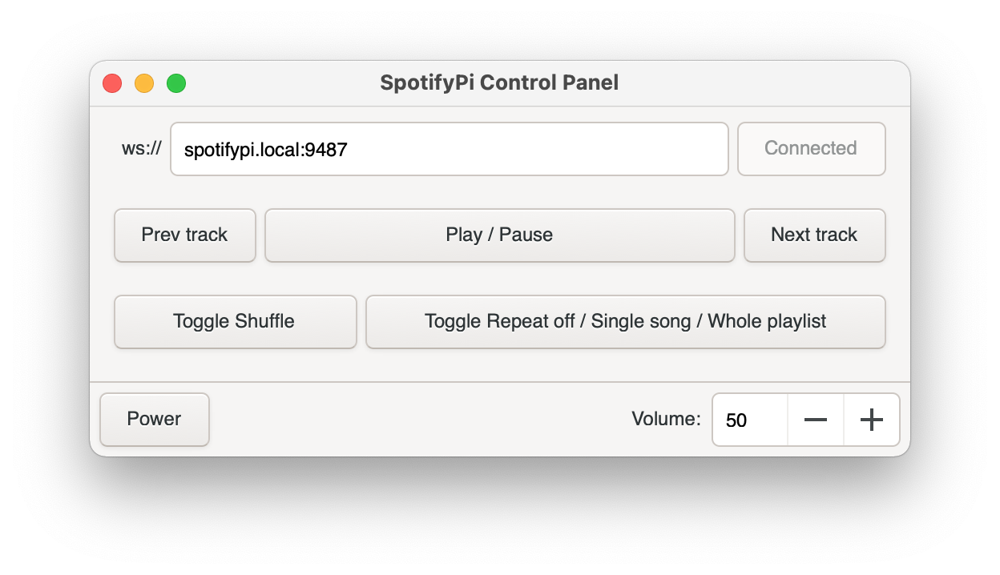

# SpotifyPi Control Panel

## Compile & Run

1. Install [rustup](https://www.rust-lang.org/tools/install).
2. Install `GTK 3` dev packages:
    - **macOS**:
        ```
        $ brew install gtk+3
        $ brew install gnome-icon-theme
        ```
    - **Debian** / **Ubuntu**:
        ```
        $ sudo apt install libgtk-3-dev build-essential
        ```
    - **Windows**:
        1. Install [MSYS2](https://www.msys2.org/).
        2. Install dev packages from `MSYS2` shell:
            ```
            $ pacman -S --needed base-devel mingw-w64-x86_64-toolchain
            $ pacman -S mingw-w64-x86_64-gtk3
            ```
        3. Edit environment variable:
            - add `C:\msys64\mingw64\bin` to `Path`.
            - add `C:\msys64\mingw64\lib` to `GTK_LIB_DIR`.
        4. Add toolchain target, open a `PowerShell`, and run:
            ```
            PS C:\> rustup target add x86_64-pc-windows-gnu
            ```
        5. Change toolchain target:
            ```
            PS C:\> rustup default stable-x86_64-pc-windows-gnu
            ```
        6. Check default toolchain target:
            ```
            PS C:\> rustup show
            ...
            stable-x86_64-pc-windows-gnu (default)
            stable-x86_64-pc-windows-msvc 
            ...
            ```
3. Clone this repo, and `cd` to repo directory.
4. Build app:
    ```
    $ cargo build --release
    ```
5. Run app:
    - On **Windows**, open `target\release` directory, double click `spotifypi-control-panel.exe`.
    - On **Linux** or **macOS**, run `target/release/spotifypi-control-panel` from `Terminal`.

<br>

## Screenshot



